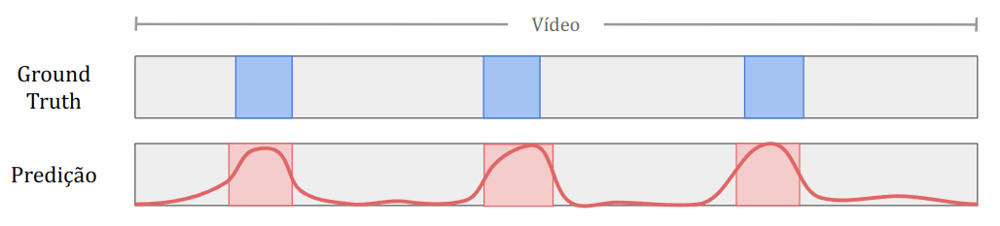
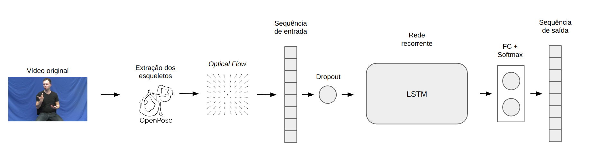

# Sign Language Segmentation using Pose

Given an input video where a person is signing, sentence segmentation is the task of dividing this video into *meaningful segments*. Therefore, we aim to identify frames that belong to the boundary between these segments.



## Execution Environment

This repository contains a `Dockerfile` describing a Docker environment that runs all experiments.

Creating the Docker image:

`docker build -t segmentation_baseline .`

Creating a container based on the image:

`cd sl-segmentation && docker run --gpus all -it -v "$PWD":/sl-segmentation segmentation_baseline`

## Preprocessing

The input data consists of pose estimates extracted with Mediapipe and converted to the OpenPose format for each frame of each video in the dataset. Preprocessing organizes the data for training and validation in `tfrecord` format containing the following fields:
- `fps` (`Int64List`): video framerate
- `pose_data` (`BytesList`): pose estimate, in a tensor of shape `(frames, 1, keypoints, 2)`
- `pose_confidence` (`BytesList`): confidence of the pose estimate, in a tensor of shape `(frames, 1, keypoints)`
- `is_signing` (`BytesList`): indication of whether the frame belongs to a boundary (1) or not (0) for each frame

The *keypoint* coordinates are normalized relative to the video resolution.

To process the data:

`python3 ./preprocessing/build_tfrecord_train.py --skel <folder-with-skeleton-folders> --type_skel "OpenPose" --annot <folder-with-annotations> --fps 30 --output data/dataset`

A folder with JSON pose estimates `data/skel/video_1` will have a corresponding annotation file `data/annot/video_1.txt` containing 0 and 1 values for each frame, with the annotation for each frame on a line in the text file.

## Experiments

### Data Distribution

To extract simple statistics about the response variable composition, simply run:

`cd python3 explore_dataset.py --dataset_path data/dataset.tfrecord`

### Architecture

The architecture used is based on the sign language detection model proposed by [Moryossef et al (2020)](https://slrtp.com/papers/full_papers/SLRTP.FP.04.017.paper.pdf). The idea is to evaluate the performance of a detection model on a segmentation task, as these two problems are defined similarly.

Given the sequence of poses extracted from a video, the *optical flow* of the skeleton is computed for each pair of frames. The *optical flow F* for each point *P* of the skeleton at time *t* is defined as the L2 norm of the vector resulting from the difference between two consecutive frames:

```math
F(P)_t = ||P_t - P_{t-1}||_2 * fps

```

If a point *P* is not detected in frame *t*, the optical flow value is zero.

The sequence generated by the optical flow extraction is fed into an LSTM recurrent network (uni- or bidirectional). Experiments evaluated modifications to the hyperparameters of this network.



The model is trained using the Adam optimizer and the Weighted Binary Cross Entropy loss function.

### Running Training

To run training, you need to set the hyperparameters in `args.py` and then execute:

`python3 train.py --model_path results/models/<model_name>.h5 --dataset_path data/dataset.tfrecord | tee results/logs/<log-file-name>.log`

The loss plot, predictions for the test dataset, the model, and the log will be saved in the `results` folder. If any changes are needed, modify the `train.py` script.

### Creating Plots for Test Data

To visualize annotation vs. prediction plots on the test set, use the `plot_result.py` script. The paths for the model and where to save the results are defined in the file itself:

`python3 plot_result.py --dataset_path data/dataset.tfrecord`

